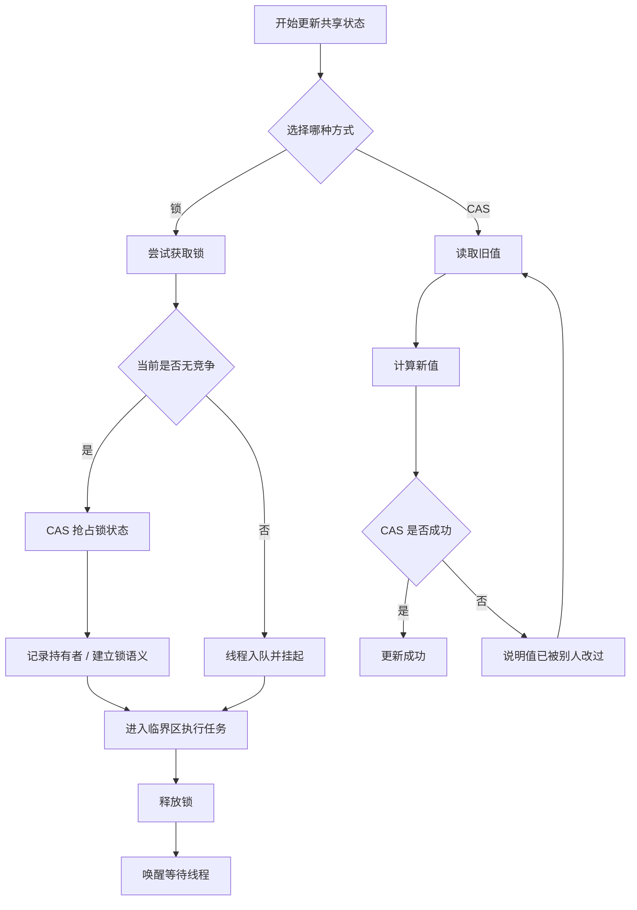

# ReentrantLock 是 CAS 吗

## 问题

`ReentrantLock` 是 CAS 吗？

## 结论

不是。`ReentrantLock` 不是 CAS 本身，它是一个**基于 AQS 的可重入锁**。  
但它的底层在无竞争时会**使用 CAS** 来快速抢占锁状态。

## 怎么理解

可以把它拆成两层看：

- **CAS**：一种原子更新手段，负责“比较并交换”；
- **ReentrantLock**：一个完整的锁实现，负责排队、阻塞、唤醒、重入计数、所有者记录等。

所以更准确的表达是：

```text
ReentrantLock = AQS + CAS 快速路径 + 队列阻塞/唤醒
```

## 典型流程

以非公平锁为例，`lock()` 大致是这样：

```java
if (compareAndSetState(0, 1)) {
    setExclusiveOwnerThread(currentThread);
} else {
    acquire(1);
}
```

含义如下：

1. 先尝试用 CAS 把 `state` 从 `0` 改成 `1`；
2. 如果成功，说明当前线程直接拿到锁；
3. 如果失败，说明锁已被占用，就进入 AQS 队列等待。

## 为什么它不是“纯 CAS”

因为锁除了“抢到一个状态值”之外，还要处理很多事情：

- 记录当前持有锁的线程是谁；
- 支持同一线程重复加锁，也就是可重入；
- 失败时让线程排队；
- 在解锁时唤醒等待线程；
- 保证临界区内的内存可见性。

这些都不是 CAS 单独能完成的，必须依赖 AQS 和阻塞/唤醒机制。

## 和 CAS 计数器的区别

在前面的 CAS 计数器里，核心目标只是更新一个数值：

```java
do {
    oldValue = value.get();
    newValue = oldValue + 1;
} while (oldValue != value.compareAndSwap(oldValue, newValue));
```

这里 CAS 直接完成业务更新。

而 `ReentrantLock` 里，CAS 只是“抢锁”的第一步，后面还有：

- 排队；
- 挂起；
- 唤醒；
- 重入控制。

所以它不是 CAS，而是**使用 CAS 的锁**。

## 一句话总结

`ReentrantLock` 不是 CAS；它是一个基于 AQS 的锁，CAS 只负责它的无竞争快速路径。

---

## 锁和 CAS 的性能代价

### 问题

如果要快速获取无竞争的锁，为什么说至少也要一次 CAS，再加上一些锁相关操作？

### 解释

即使没有线程竞争，锁也不是“白拿”的。以 `ReentrantLock` 为例，抢锁时通常要做这些事：

1. 用 CAS 检查并修改锁状态；
2. 记录当前持有锁的线程；
3. 建立锁语义和内存可见性；
4. 释放时清理持有者信息；
5. 如果有等待线程，还要负责唤醒。

所以“无竞争锁”并不等于“零开销锁”，它至少要付出一次 CAS 和一组锁管理操作。

### 为什么 CAS 可能更快

CAS 的路径更短：

- 不需要把线程挂起；
- 不需要进入等待队列；
- 不需要依赖内核调度；
- 低竞争时通常一次就成功。

因此在竞争不高时，CAS 往往比锁更快。

### 为什么锁也有价值

锁的好处是它帮你处理了竞争：

- 抢不到时自动排队；
- 线程阻塞后不会空转；
- 解锁时自动唤醒等待者；
- 程序员不用手工写重试、退避和放弃逻辑。

所以锁更“省心”，CAS 更“轻量”。

### 流程图



### 一句话总结

- **锁**：帮你排队和处理冲突，但管理成本更高。
- **CAS**：路径短、开销小，但失败后的重试和退避要你自己处理。
